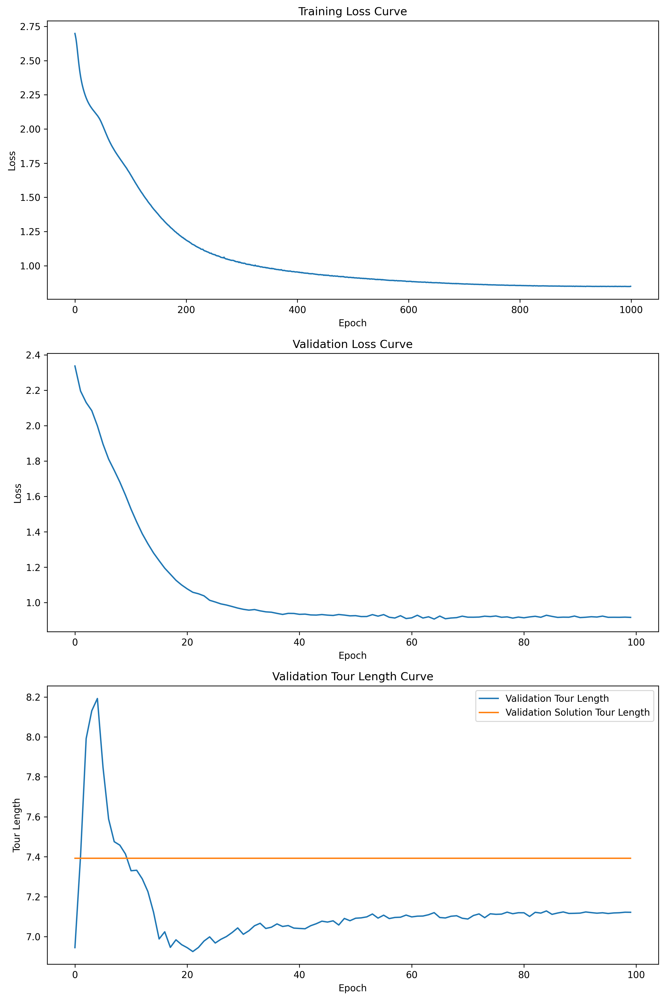
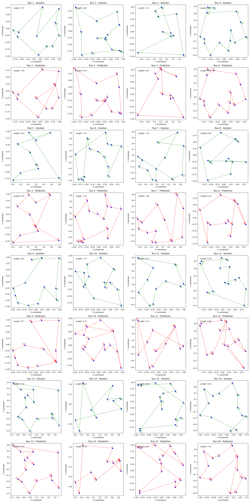
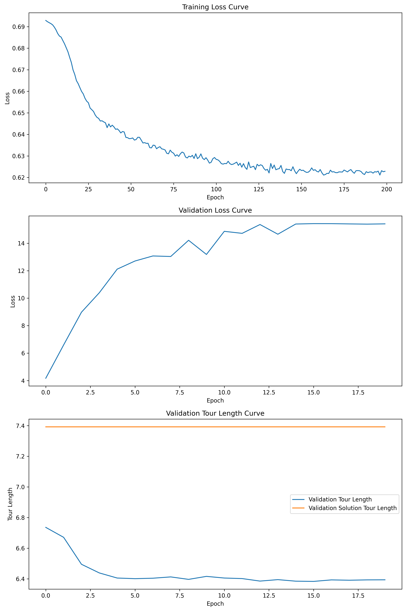
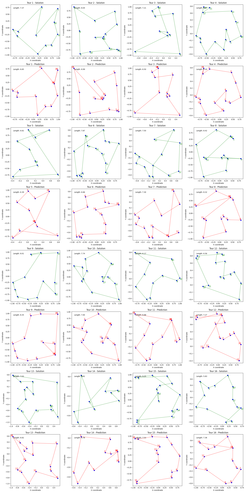

# TSP Solver with Transformer

This project implements a Transformer-based solver for the Traveling Salesman Problem (TSP).

## Installation

1. Clone the repository:
   ```
   git clone https://github.com/your-username/tsp-transformer-solver.git
   cd tsp-transformer-solver
   ```

2. Create and activate a conda environment:
   ```
   conda create -n tsp-playground python=3.9
   conda activate tsp-playground
   ```


3. Clone and install the Concorde TSP Solver:
   ```
   git clone https://github.com/jvkersch/pyconcorde.git
   cd pyconcorde
   pip install -e .
   cd ..
   ```

   Note: Concorde requires a C compiler. Make sure you have one installed on your system.

4. Install the required packages:
   ```
   pip install torch torchvision numpy matplotlib einops tqdm
   ```

## Training and Evaluation

To train the model with supervised learning:

1. Run the following command:
   ```
   python main.py --mode train --max_epochs 10000 --experiment_name your_experiment_name --max_lr 1e-3 --use_scheduler
   ```

   You can adjust the following parameters:
   - `--max_epochs`: Set the maximum number of training epochs
   - `--experiment_name`: Choose a name for your experiment
   - `--max_lr`: Set the maximum learning rate
   - `--use_scheduler`: Include this flag to use the learning rate scheduler

2. The training process will log information to the console and save checkpoints and visualizations in the experiment directory.

To evaluate the model:

1. After training, run the following command:
   ```
   python main.py --mode evaluate --experiment_name your_experiment_name --load_checkpoint
   ```

   Make sure to use the same `experiment_name` as used during training.

2. The evaluation results will be displayed in the console, showing the validation loss and tour length.


## Results
### Supervised Learning
With the following dataloader setup:

```
train_dataloader = get_tsp_dataloader(
    batch_size=2048,
    num_samples=51200,
    min_points=10,
    max_points=15,
    seed=42,
)
val_dataloader = get_tsp_dataloader(
    batch_size=2048,
    num_samples=5120,
    min_points=10,
    max_points=15,
    seed=21,
)
```

The following training curves were achieved after 1000 epochs of training:



It looks like after 1000 epochs the model is unepxectedly overperforming the solution provided by the Concorde TSP Solver.

The tours from the trained model can be visualized as follows:




### Reinforcement Learning with DPO
With the same dataloader setup as above, the following training curves were achieved after 100 epochs of training:



To stablize the training, a smaller max learning rate of 1e-5 were used.

From here, another imporvement in the averaged tour length can be seen.

The tours from the trained model can be visualized as follows:



### Comparison with Baselines
Here's a comparison table of the baseline supervised learning method and the DPO method:

| Method | Average Tour Length | Improvement (%) |
|--------|-----------------|-----------------|
| Baseline | 7.392| 0.00%|
| Supervised Learning | 7.122 | 3.65%|
| DPO Fine-tuning | 6.393 | 13.51%|

As we can see from the table:

1. The DPO fine-tuning method achieved a lower average tour length compared to the supervised learning method, indicating better overall performance.
2. Both methods are performing slightly better than the average solution tour length provided by the Concorde TSP Solver, which is an interesting observation that may warrant further investigation.

These results demonstrate that the DPO fine-tuning approach provides a noticeable improvement over the baseline supervised learning method for solving the Traveling Salesman Problem.


